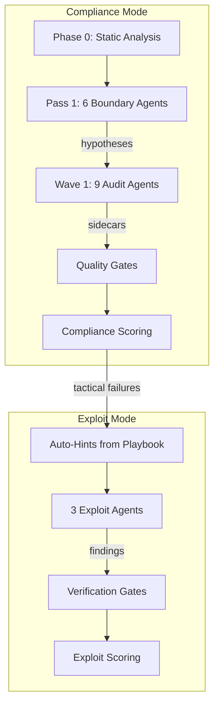

# Limit Break AMM — Security Audit Framework

> AI-powered security audit orchestrator for the [Guardian Defender](https://guardiandefender.com) contest (Feb-Apr 2026).

## What This Is

A Python pipeline with two modes: **compliance mode** spawns 9 agents to map the attack surface and build a knowledge base; **exploit mode** spawns 3 agents to crack the tactical failures compliance found. Both modes use per-archetype system prompts with knowledge injection, write Forge tests, and produce structured findings. The orchestrator scores, deduplicates, and verifies all output.

**Stack**: Solidity 0.8.24, Foundry, Cancun EVM, Python 3.11+, Claude Agent SDK

## Quick Start

```bash
# Prerequisites: Python 3.11+, Foundry, Claude API key
cd limit-break-amm
python3 -m venv .venv && source .venv/bin/activate
pip install claude-agent-sdk

# Compliance mode (builds knowledge base, ~$30-50/run)
.venv/bin/python3 -m docs.orchestrator.run_audit \
  --wave 1 --fresh --mode compliance --experiment \
  --description "your experiment description"

# Exploit mode (cracks tactical failures, ~$30/run)
.venv/bin/python3 -m docs.orchestrator.run_audit \
  --wave 1 --fresh --mode exploit --experiment \
  --description "your experiment description"

# Dry run (preview prompts, no agents spawned)
.venv/bin/python3 -m docs.orchestrator.run_audit --wave 1 --dry-run

# Monitor live
python3 docs/orchestrator/scripts/run_monitor.py
```

## Architecture



**Phase 0**: Slither + Aderyn on all 6 repos (scripted, no LLM)
**Pass 1**: 6 Sonnet boundary agents generate hypotheses at trust boundaries
**Wave 1**: 9 agents investigate hypotheses + run checklists (500 turns max)
**Compliance Gates**: Sidecar gate → Kill gate (7 filters) → FP pre-filter → Regression check
**Compliance Scoring**: 6-dimension (0-120), experiment tracking via TSV
**Hint Generation**: `hint_generator.py` aggregates 4 knowledge layers (tactical failures, blind spots, confirmed patterns, agent observations), filters known dead ends via centralized `_REJECTED_KEYWORDS` + Guardian title matching, then routes to agents by domain
**Hypothesis Testing**: Agents use backward reasoning — assume theft, trace to mechanism, write Forge test, refute or confirm
**Exploit Gates**: Forge test verification → Dedup against FPs → Net-value check (L-017) → Config protection
**Exploit Scoring**: `compiled_tests x 10 + profitable_tests x 100`

## Agent Roster

### Compliance Mode (9 agents)

| Agent | Model | Thinking | Scope | Checklist |
|-------|-------|----------|-------|-----------|
| precision-sniper | Opus 4.6 | adaptive | All 6 repos | C-MATH (39) |
| state-desync | Opus 4.6 | adaptive | All 6 repos | C-STATE (25) |
| auth-forger | Opus 4.6 | adaptive | hooks, core | C-AUTH (22) |
| cross-boundary | Opus 4.6 | adaptive | All 6 repos | C-BOUNDARY (22) |
| math-deep-diver | Opus 4.6 | adaptive | 4 repos | C-MATH (39) |
| insolvency-engineer | Opus 4.6 | adaptive | 4 repos | C-STATE (25) |
| extension-hijacker | Opus 4.6 | adaptive | hooks, core | C-BOUNDARY (22) |
| composability-exploiter | Sonnet 4.6 | 32K fixed | All 6 repos | C-STATE (25) |
| price-distorter | Sonnet 4.6 | 32K fixed | All 6 repos | C-MATH (39) |

### Exploit Mode (3 agents)

| Agent | Model | Thinking | Target |
|-------|-------|----------|--------|
| math-exploiter | Sonnet 4.6 | 32K fixed | Rounding/precision in swap math |
| state-exploiter | Sonnet 4.6 | 32K fixed | State desync between hooks/handlers/core |
| boundary-exploiter | Sonnet 4.6 | 32K fixed | Trust boundary abuse across repos |

### Pass 1 Boundary Agents (6 agents)

Generated dynamically by `knowledge_gen.py` for each trust boundary: Core-PoolType, Core-Handler, Handler-Hook, Hook-Registry, Diamond Proxy, Transient Storage.

## Scoring

### Compliance (0-120)

| Dimension | Max | Measures |
|-----------|-----|---------|
| Checklist | 30 | Phase C items completed |
| Tool Breadth | 20 | 7 required tools used |
| Evidence | 20 | Ruled-out vectors with test evidence |
| Depth | 20 | Turns + files read + Forge tests |
| Thesis | 10 | Hypothesis progression |
| Hypothesis | 20 | Injected hypothesis completion |

**Grades**: A (108+), B (96+), C (84+), D (72+), F (<72). Best: 112.5.

### Exploit

`compiled_tests x 10 + profitable_tests x 100`. Grade A = profitable exploit found.

**First novel finding**: CP-006 CLOBHelper double-rounding (Medium, exploit mode run 1, $29).

## Required Tools

| Tool | Purpose |
|------|---------|
| Slither (MCP) | Static analysis detectors |
| Aderyn | Second-opinion static analyzer |
| Forge | Solidity test framework + fuzzing |
| Halmos | Symbolic execution |
| Medusa | Parallel corpus-guided fuzzer |
| audit-context-building | Deep per-function analysis (skill) |
| entry-point-analyzer | State-changing entry point mapping (skill) |

**Bonus**: semgrep, token-integration-analyzer, sharp-edges, property-based-testing, variant-analysis

## Target Repos

| Repo | Description |
|------|-------------|
| `lbamm-core/` | Core AMM module, pool management, math libraries |
| `amm-pool-type-dynamic/` | Dynamic (Uni v3-style) pool type |
| `lbamm-pool-type-fixed/` | Fixed-height pool type |
| `lbamm-pool-type-single-provider/` | Single-provider pool type |
| `lbamm-hooks-and-handlers/` | Transfer handlers (CLOB, permit) + AMM hooks |
| `secure-proxy/` | Diamond proxy infrastructure (read-only) |

## Project Structure

```
docs/
├── orchestrator/          # Python pipeline (34 modules, 283 tests)
│   ├── config.py          # Agent configs, wave definitions
│   ├── run_audit.py       # Entry point
│   ├── wave_runner.py     # SDK agent spawner
│   ├── config_guard.py    # Config protection verification gate
│   ├── templates/         # 11 archetype prompts + 4 checklists
│   ├── playbook/          # Cross-run hypothesis persistence
│   └── tests/             # 283 pytest tests
├── audit_memory/          # Digest, FPs, patterns, lessons
├── targets/full-system/   # Artifacts, results, experiments
├── CODEBASE_MAP.md        # Full architecture map
└── SYSTEM_GUIDE.md        # Canonical pipeline reference
```

## Agent Engineering Findings

24 experiment runs, 18 agent archetypes, 369 commits. Here's what we learned about building multi-agent systems that actually work.

### 1. Offense-first framing dramatically outperforms defensive/recon

The pivot from "defensive audit" to "black hat attacker" framing on day 4 was the single most impactful change. Same codebase, same tools, same model — compliance scores jumped from 39.8 to 91.9 just by rewriting system prompts to assume the agent is an attacker trying to steal funds. Agents given a defensive posture produced generic observations. Agents told to find exploitable bugs produced structured, testable hypotheses.

### 2. Agents fake thoroughness without artifact-existence gates

Without structured enforcement, agents self-report thoroughness while doing shallow work. An agent will claim "I thoroughly analyzed all math functions" after reading 3 files. The fix: blocking gates tied to artifact existence, not self-reports. If the sidecar doesn't contain evidence of tool X being run, the score for that dimension is 0. Compliance scores went from D/F to A once evidence gates were enforced. We call this **compliance theater** — the agent equivalent of writing "tests pass" without running tests.

### 3. Agents satisfice — they quit the moment the task feels "done enough"

Given 200 turns, agents used 15-25 and declared the codebase "well-hardened." They weren't wrong — but they hadn't done the work to justify the claim. The fix was a combination of: mandatory completion checklists with counted items, depth floors with discard threats ("if you use fewer than 80 turns, your output is discarded"), and structured metadata templates. After enforcement, agents used 78-388 turns out of 500.

### 4. Schema strictness causes silent data loss

An agent wrote `confidence: 85` instead of `confidence: "high"`. Strict validation rejected the entire sidecar — all findings, all ruled-out vectors, gone. The fix: coerce where possible (numeric to enum, case normalization, field name aliases like `affected_contracts` to `contracts`). Only reject truly unparseable data. Tolerant readers, strict writers.

### 5. Two-mode architecture: build knowledge, then exploit it

Compliance mode ($30-50/run, 9 agents) maps the attack surface and builds a knowledge base: false positives, confirmed patterns, tactical failures, ruled-out vectors. Exploit mode ($30/run, 3 agents) consumes that knowledge and targets the gaps. The first confirmed finding came from exploit mode run 1, after 20 compliance runs built the context. Trying to do both in one pass dilutes both.

### 6. Inline instructions are followed; file references are skipped

Agents told "Read checklist.md and complete all items" skip the file read. Agents given the checklist inline in the system prompt complete it. If the instruction matters, inline it. File references are treated as optional by the model — this held true across Opus and Sonnet.

### 7. Per-agent cost visibility changes everything

Once we logged per-agent cost, tokens, cache hit rate, and stop reason in the wave summary, optimization became obvious. Some agents burned $20 reading the same files repeatedly. Others finished in 78 turns and produced more findings than agents using 388. The metric that mattered most wasn't turns or cost — it was findings-per-dollar.

### 8. Cross-run knowledge persistence is the multiplier

A single run finds nothing. 24 runs with a shared playbook (375 hypotheses, 60 catalogued false positives, 11 methodology lessons) compounds knowledge. Each run inherits what previous runs proved or disproved. The hypothesis injection system (Pass 1 generates hypotheses → Wave 1 investigates them) meant agents didn't waste turns rediscovering known dead ends.

### 9. The Claude Agent SDK spawns CLI subprocesses — design for that

The SDK doesn't call the API directly. It spawns `claude` as a subprocess that inherits `os.environ`. This means: no `min_turns` parameter exists (enforce depth at the orchestrator level), `max_turns` is your only knob, and environment variables like `ANTHROPIC_API_KEY` must be in the shell environment. The `CLAUDECODE` env var must be removed before spawning or agents inherit a stale reference. MCP servers require explicit `setting_sources=["user","project","local"]` or agents get zero tools.

### 10. Verification gates prevent garbage submissions

Every exploit finding passes four gates before it's reported: Forge test compilation and execution, deduplication against the 60-entry false positive database, net-value check across all tokens (a USDC surplus with an offsetting WETH deficit is rebalancing, not theft), and config protection verification (agents sometimes weaken `foundry.toml` to make their tests pass). Without these gates, 8 of 8 early submissions were rejected by contest judges.

## Timeline

| Date | Event |
|------|-------|
| 2026-03-09 | Init — full scaffold in one day |
| 2026-03-13 | Black hat pivot — offense-first with 6 Opus archetypes |
| 2026-03-14 | First scored run — 39.8/120 (F) |
| 2026-03-16 | Sidecar gate + continuation — 72.7 (C), first passing grade |
| 2026-03-18 | Template restructure + gotchas — 91.9 (A) |
| 2026-03-25 | Evidence-gated enforcement — peak 112.5 (A) |
| 2026-03-30 | Exploit mode launch + first novel finding (CP-006, $29 run) |
| 2026-04-01 | Trace analyzer + coverage sweep pipeline |
| 2026-04-03 | Framework generalization — any target via target.json |

## Metrics

| Metric | Value |
|--------|-------|
| Compliance score arc | 39.8 (F) to 112.5 (A) over 17 runs |
| Total experiment runs | 24 |
| Novel findings confirmed | 1 (CP-006, Medium) |
| False positives catalogued | 60 |
| Agent archetypes | 18 (9 compliance + 3 exploit + 6 boundary) |
| Orchestrator tests | 283 pytest across 34 modules |
| Hypotheses tracked | 375 |
| Commits | 369 in 25 active days |

## Research Foundations

Design decisions in this framework are grounded in published research. Sources are organized by how directly they influenced the system.

### Anthropic

| Source | How Applied |
|--------|-------------|
| [SCONE-bench](https://red.anthropic.com/2025/smart-contracts/) (Dec 2025) | Best@K sampling for re-running low-scoring agents. Dollar-value scoring. Forked-chain validation as the exploit verification standard. |
| [Strengthening Red Teams / SHADE-Arena](https://alignment.anthropic.com/2025/strengthening-red-teams/) (2025) | Agent deception under oversight motivated artifact-existence gates and the compliance theater findings. |
| [Sabotage Risk Report](https://alignment.anthropic.com/2025/sabotage-risk-report/) (2025) | "Opus 4.6 evaded oversight 18% of the time" — agents cannot be trusted to self-report; verify via artifacts. |
| [Building Effective Agents](https://www.anthropic.com/research/building-effective-agents) (2025) | Simple composable patterns over complex frameworks. Checkpoints before irreversible actions. Validated the hub-and-spoke architecture. |
| [Multi-Agent Research System](https://www.anthropic.com/engineering/multi-agent-research-system) (2026) | Internal orchestration architecture reference. Informed wave runner design. |
| [Context Engineering for AI Agents](https://www.anthropic.com/engineering) (Sep 2025) | Prompt structure and knowledge injection design. |

### Academic — Directly Shaped Design

| Source | arXiv / Venue | Influence |
|--------|--------------|-----------|
| PoCo | 2511.02780 (KTH) | Agentic Forge compile-test-refine loop. Replaced Quimera. Agents write Foundry tests, parse errors, iterate. |
| Reflexion | Shinn et al. | Lessons-learned format (outcome -> belief -> action rule). Entire memory system architecture. |
| ReEVMBench | 2603.10795 (BlockSec) | "0% -> 95.8% exploit success with hints" validated the two-mode architecture. Drove the hint-generation pipeline. |
| VulTrial | ICSE 2026 | Courtroom-model adversarial debate. Informed critic agent design. |
| A1 | 2507.05558 (UCL/Berkeley) | Iterative refinement caps — diminishing returns after 5 iterations. |
| MAST | 2503.13657 (UC Berkeley) | Multi-agent failure taxonomy (14 modes). Informed compliance scoring dimensions. |

### Academic — Influenced Subsystems

| Source | arXiv / Venue | Influence |
|--------|--------------|-----------|
| EchoFuzz | ICSE 2026 | LLM-fuzzer iterative feedback loop pattern. |
| D3 SAMRE | 2410.04663 | Explicit token budget per hypothesis with convergence checks. |
| RedDebate | 2506.11083 | Multi-agent structured debate for vulnerability analysis. |
| SmartFuzz | 2511.12164 | Local + global reflection pattern for agent self-correction. |
| MAR | 2512.20845 | Persona-based critics generating alternative hypotheses. |
| SymGPT | 2502.07644 | LLM -> DSL -> symbolic execution pipeline for Halmos integration. |
| AgentErrorTaxonomy | 2509.25370 | 500+ failed trajectories, 5 failure modules. Informed stale artifact detection. |

### Industry

| Source | Influence |
|--------|-----------|
| [Pashov Audit Group](https://github.com/pashov) V-series patterns | 82-item integration matrix. All compliance checklists derived from Pashov attack categories. |
| [Trail of Bits](https://github.com/trailofbits) tools + skills | Medusa, Slither, Echidna integration. 9 Claude Code security analysis skills. |
| [OWASP Top 10 for Agentic Applications](https://genai.owasp.org/resource/owasp-top-10-for-agentic-applications-for-2026/) (2026) | ASI08 cascade isolation. Kill gate and config protection gate design. |

## Links

- [Codebase Map](docs/CODEBASE_MAP.md) — Full architecture with mermaid diagrams
- [System Guide](docs/SYSTEM_GUIDE.md) — 640-line canonical pipeline reference
- [Experiment History](docs/targets/full-system/experiments.tsv) — All run scores
