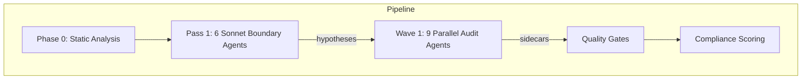

# Limit Break AMM — Security Audit Framework

> AI-powered security audit orchestrator for the [Guardian Defender](https://guardiandefender.com) contest (Feb-Apr 2026).

## What This Is

A Python pipeline that spawns 9 specialized Claude agents in parallel to hunt for exploitable vulnerabilities in the Limit Break AMM smart contracts. Agents write Forge tests, run static analyzers, and produce structured findings. The orchestrator scores their work on 6 compliance dimensions, deduplicates across agents, and tracks progress across runs.

**Stack**: Solidity 0.8.24, Foundry, Cancun EVM, Python 3.11+, Claude Agent SDK

## Quick Start

```bash
# Prerequisites: Python 3.11+, Foundry, Claude API key
cd limit-break-amm
python3 -m venv .venv && source .venv/bin/activate
pip install claude-agent-sdk

# Run a full audit (Pass 1 hypotheses + Wave 1 agents)
.venv/bin/python3 -m docs.orchestrator.run_audit \
  --wave 1 --fresh --experiment \
  --description "your experiment description"

# Monitor live
python3 docs/orchestrator/scripts/run_monitor.py
```

## Architecture



**Phase 0**: Slither + Aderyn on all 6 repos (scripted, no LLM)
**Pass 1**: 6 Sonnet boundary agents generate hypotheses at trust boundaries
**Wave 1**: 9 agents investigate hypotheses + run checklists (500 turns max)
**Gates**: Sidecar gate → Kill gate (7 filters) → FP pre-filter → Regression check
**Scoring**: 6-dimension compliance (0-120), experiment tracking via TSV

## Agent Roster

| Agent | Model | Thinking | Scope | Checklist |
|-------|-------|----------|-------|-----------|
| precision-sniper | Opus 4.6 | adaptive | All 6 repos | C-MATH (39) |
| state-desync | Opus 4.6 | adaptive | All 6 repos | C-STATE (25) |
| auth-forger | Opus 4.6 | adaptive | hooks, core | C-AUTH (22) |
| cross-boundary | Opus 4.6 | adaptive | All 6 repos | C-BOUNDARY (22) |
| math-deep-diver | Opus 4.6 | adaptive | 4 repos | C-MATH (39) |
| insolvency-engineer | Opus 4.6 | adaptive | 4 repos | C-STATE (25) |
| extension-hijacker | Opus 4.6 | adaptive | hooks, core | C-BOUNDARY (22) |
| composability-exploiter | Sonnet 4.6 | 32K fixed | All 6 repos | C-STATE (25) |
| price-distorter | Sonnet 4.6 | 32K fixed | All 6 repos | C-MATH (39) |

## Compliance Scoring (0-120)

| Dimension | Max | Measures |
|-----------|-----|---------|
| Checklist | 30 | Phase C items completed |
| Tool Breadth | 20 | 7 required tools used |
| Evidence | 20 | Ruled-out vectors with test evidence |
| Depth | 20 | Turns + files read + Forge tests |
| Thesis | 10 | Hypothesis progression |
| Hypothesis | 20 | Injected hypothesis completion |

**Grades**: A (108+), B (96+), C (84+), D (72+), F (<72)

## Required Tools

| Tool | Purpose |
|------|---------|
| Slither (MCP) | Static analysis detectors |
| Aderyn | Second-opinion static analyzer |
| Forge | Solidity test framework + fuzzing |
| Halmos | Symbolic execution |
| Medusa | Parallel corpus-guided fuzzer |
| audit-context-building | Deep per-function analysis (skill) |
| entry-point-analyzer | State-changing entry point mapping (skill) |

**Bonus**: semgrep, token-integration-analyzer, sharp-edges, property-based-testing, variant-analysis

## Target Repos

| Repo | Description |
|------|-------------|
| `lbamm-core/` | Core AMM module, pool management, math libraries |
| `amm-pool-type-dynamic/` | Dynamic (Uni v3-style) pool type |
| `lbamm-pool-type-fixed/` | Fixed-height pool type |
| `lbamm-pool-type-single-provider/` | Single-provider pool type |
| `lbamm-hooks-and-handlers/` | Transfer handlers (CLOB, permit) + AMM hooks |
| `secure-proxy/` | Diamond proxy infrastructure (read-only) |

## Project Structure

```
docs/
├── orchestrator/          # Python pipeline (27 modules, 219 tests)
│   ├── config.py          # Agent configs, wave definitions
│   ├── run_audit.py       # Entry point
│   ├── wave_runner.py     # SDK agent spawner
│   ├── templates/         # 9 archetype prompts + 4 checklists
│   ├── playbook/          # Cross-run hypothesis persistence
│   └── tests/             # 219 pytest tests
├── audit_memory/          # Digest, FPs, patterns, lessons
├── targets/full-system/   # Artifacts, results, experiments
├── CODEBASE_MAP.md        # Full architecture map
└── SYSTEM_GUIDE.md        # Canonical pipeline reference
```

## Links

- [Codebase Map](docs/CODEBASE_MAP.md) — Full architecture with mermaid diagrams
- [System Guide](docs/SYSTEM_GUIDE.md) — 640-line canonical pipeline reference
- [Experiment History](docs/targets/full-system/experiments.tsv) — All run scores
