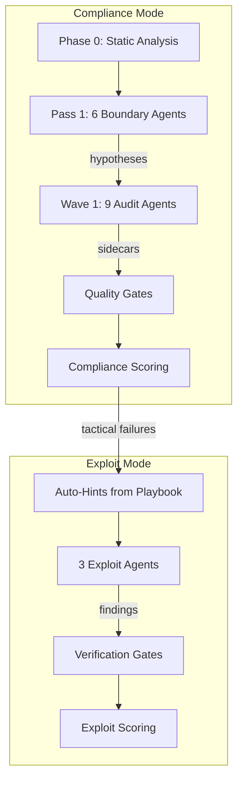

# Limit Break AMM — Security Audit Framework

> AI-powered security audit orchestrator for the [Guardian Defender](https://guardiandefender.com) contest (Feb-Apr 2026).

## What This Is

A Python pipeline with two modes: **compliance mode** spawns 9 agents to map the attack surface and build a knowledge base; **exploit mode** spawns 3 agents to crack the tactical failures compliance found. Both modes use per-archetype system prompts with knowledge injection, write Forge tests, and produce structured findings. The orchestrator scores, deduplicates, and verifies all output.

**Stack**: Solidity 0.8.24, Foundry, Cancun EVM, Python 3.11+, Claude Agent SDK

## Quick Start

```bash
# Prerequisites: Python 3.11+, Foundry, Claude API key
cd limit-break-amm
python3 -m venv .venv && source .venv/bin/activate
pip install claude-agent-sdk

# Compliance mode (builds knowledge base, ~$30-50/run)
.venv/bin/python3 -m docs.orchestrator.run_audit \
  --wave 1 --fresh --mode compliance --experiment \
  --description "your experiment description"

# Exploit mode (cracks tactical failures, ~$30/run)
.venv/bin/python3 -m docs.orchestrator.run_audit \
  --wave 1 --fresh --mode exploit --experiment \
  --description "your experiment description"

# Dry run (preview prompts, no agents spawned)
.venv/bin/python3 -m docs.orchestrator.run_audit --wave 1 --dry-run

# Monitor live
python3 docs/orchestrator/scripts/run_monitor.py
```

## Architecture



**Phase 0**: Slither + Aderyn on all 6 repos (scripted, no LLM)
**Pass 1**: 6 Sonnet boundary agents generate hypotheses at trust boundaries
**Wave 1**: 9 agents investigate hypotheses + run checklists (500 turns max)
**Compliance Gates**: Sidecar gate → Kill gate (7 filters) → FP pre-filter → Regression check
**Compliance Scoring**: 6-dimension (0-120), experiment tracking via TSV
**Hint Generation**: `hint_generator.py` aggregates 4 knowledge layers (tactical failures, blind spots, confirmed patterns, agent observations), filters known dead ends via centralized `_REJECTED_KEYWORDS` + Guardian title matching, then routes to agents by domain
**Hypothesis Testing**: Agents use backward reasoning — assume theft, trace to mechanism, write Forge test, refute or confirm
**Exploit Gates**: Forge test verification → Dedup against FPs → Net-value check (L-017) → Config protection
**Exploit Scoring**: `compiled_tests x 10 + profitable_tests x 100`

## Agent Roster

### Compliance Mode (9 agents)

| Agent | Model | Thinking | Scope | Checklist |
|-------|-------|----------|-------|-----------|
| precision-sniper | Opus 4.6 | adaptive | All 6 repos | C-MATH (39) |
| state-desync | Opus 4.6 | adaptive | All 6 repos | C-STATE (25) |
| auth-forger | Opus 4.6 | adaptive | hooks, core | C-AUTH (22) |
| cross-boundary | Opus 4.6 | adaptive | All 6 repos | C-BOUNDARY (22) |
| math-deep-diver | Opus 4.6 | adaptive | 4 repos | C-MATH (39) |
| insolvency-engineer | Opus 4.6 | adaptive | 4 repos | C-STATE (25) |
| extension-hijacker | Opus 4.6 | adaptive | hooks, core | C-BOUNDARY (22) |
| composability-exploiter | Sonnet 4.6 | 32K fixed | All 6 repos | C-STATE (25) |
| price-distorter | Sonnet 4.6 | 32K fixed | All 6 repos | C-MATH (39) |

### Exploit Mode (3 agents)

| Agent | Model | Thinking | Target |
|-------|-------|----------|--------|
| math-exploiter | Sonnet 4.6 | 32K fixed | Rounding/precision in swap math |
| state-exploiter | Sonnet 4.6 | 32K fixed | State desync between hooks/handlers/core |
| boundary-exploiter | Sonnet 4.6 | 32K fixed | Trust boundary abuse across repos |

### Pass 1 Boundary Agents (6 agents)

Generated dynamically by `knowledge_gen.py` for each trust boundary: Core-PoolType, Core-Handler, Handler-Hook, Hook-Registry, Diamond Proxy, Transient Storage.

## Scoring

### Compliance (0-120)

| Dimension | Max | Measures |
|-----------|-----|---------|
| Checklist | 30 | Phase C items completed |
| Tool Breadth | 20 | 7 required tools used |
| Evidence | 20 | Ruled-out vectors with test evidence |
| Depth | 20 | Turns + files read + Forge tests |
| Thesis | 10 | Hypothesis progression |
| Hypothesis | 20 | Injected hypothesis completion |

**Grades**: A (108+), B (96+), C (84+), D (72+), F (<72). Best: 112.5.

### Exploit

`compiled_tests x 10 + profitable_tests x 100`. Grade A = profitable exploit found.

**First novel finding**: CP-006 CLOBHelper double-rounding (Medium, exploit mode run 1, $29).

## Required Tools

| Tool | Purpose |
|------|---------|
| Slither (MCP) | Static analysis detectors |
| Aderyn | Second-opinion static analyzer |
| Forge | Solidity test framework + fuzzing |
| Halmos | Symbolic execution |
| Medusa | Parallel corpus-guided fuzzer |
| audit-context-building | Deep per-function analysis (skill) |
| entry-point-analyzer | State-changing entry point mapping (skill) |

**Bonus**: semgrep, token-integration-analyzer, sharp-edges, property-based-testing, variant-analysis

## Target Repos

| Repo | Description |
|------|-------------|
| `lbamm-core/` | Core AMM module, pool management, math libraries |
| `amm-pool-type-dynamic/` | Dynamic (Uni v3-style) pool type |
| `lbamm-pool-type-fixed/` | Fixed-height pool type |
| `lbamm-pool-type-single-provider/` | Single-provider pool type |
| `lbamm-hooks-and-handlers/` | Transfer handlers (CLOB, permit) + AMM hooks |
| `secure-proxy/` | Diamond proxy infrastructure (read-only) |

## Project Structure

```
docs/
├── orchestrator/          # Python pipeline (34 modules, 283 tests)
│   ├── config.py          # Agent configs, wave definitions
│   ├── run_audit.py       # Entry point
│   ├── wave_runner.py     # SDK agent spawner
│   ├── config_guard.py    # Config protection verification gate
│   ├── templates/         # 11 archetype prompts + 4 checklists
│   ├── playbook/          # Cross-run hypothesis persistence
│   └── tests/             # 283 pytest tests
├── audit_memory/          # Digest, FPs, patterns, lessons
├── targets/full-system/   # Artifacts, results, experiments
├── CODEBASE_MAP.md        # Full architecture map
└── SYSTEM_GUIDE.md        # Canonical pipeline reference
```

## Links

- [Codebase Map](docs/CODEBASE_MAP.md) — Full architecture with mermaid diagrams
- [System Guide](docs/SYSTEM_GUIDE.md) — 640-line canonical pipeline reference
- [Experiment History](docs/targets/full-system/experiments.tsv) — All run scores
