# Call Graphs

> **ID:** P0-09 | **Generated:** 2026-02-24 | **Method:** slither
> **Readers:** all auditors

Legend: `-->` internal call, `-.->` external call, `==>` library call

## CLOBTransferHandler

37 nodes, 40 edges

```mermaid
graph TD
    CLOBTransferHandler_closeOrder["closeOrder"] --> TstorishReentrancyGuard_nonReentrant["nonReentrant"]
    CLOBTransferHandler_closeOrder --> CLOBTransferHandler_generateOrderBookKey["generateOrderBookKey"]
    CLOBTransferHandler_closeOrder ==> CLOBHelper_closeOrder["CLOBHelper.closeOrder"]
    CLOBTransferHandler_openOrder["openOrder"] --> TstorishReentrancyGuard_nonReentrant
    CLOBTransferHandler_openOrder --> CLOBTransferHandler_getGroupKeyHook["getGroupKeyHook"]
    CLOBTransferHandler_openOrder --> CLOBTransferHandler__enforceTokenHooks["_enforceTokenHooks"]
    CLOBTransferHandler_openOrder --> CLOBTransferHandler_generateOrderBookKey
    CLOBTransferHandler_openOrder --> CLOBTransferHandler_getGroupKeyMinimumOrder["getGroupKeyMinimumOrder"]
    CLOBTransferHandler_openOrder --> CLOBTransferHandler__initializeOrderBookKeyIfNotInitialized["_initOBKIfNotInit(bytes32)"]
    CLOBTransferHandler_openOrder -.-> ICLOBHook_validateMaker["ICLOBHook.validateMaker"]
    CLOBTransferHandler_openOrder -.-> IERC20_balanceOf["IERC20.balanceOf"]
    CLOBTransferHandler_openOrder ==> SafeERC20_safeTransferFrom["SafeERC20.safeTransferFrom"]
    CLOBTransferHandler_openOrder ==> CLOBHelper_openOrder["CLOBHelper.openOrder"]
    CLOBTransferHandler_ammHandleTransfer["ammHandleTransfer"] --> TstorishReentrancyGuard_nonReentrant
    CLOBTransferHandler_ammHandleTransfer --> CLOBTransferHandler_getGroupKeyHook
    CLOBTransferHandler_ammHandleTransfer --> CLOBTransferHandler_generateOrderBookKey
    CLOBTransferHandler_ammHandleTransfer -.-> ITransferHandlerExecutorValidation_validateExecutor["validateExecutor"]
    CLOBTransferHandler_ammHandleTransfer ==> CLOBHelper_fillOrder["CLOBHelper.fillOrder"]
    CLOBTransferHandler_ammHandleTransfer ==> SafeERC20_safeTransfer["SafeERC20.safeTransfer"]
    CLOBTransferHandler_depositToken["depositToken"] --> TstorishReentrancyGuard_nonReentrant
    CLOBTransferHandler_depositToken -.-> IERC20_balanceOf
    CLOBTransferHandler_depositToken ==> SafeERC20_safeTransferFrom
    CLOBTransferHandler_withdrawToken["withdrawToken"] --> TstorishReentrancyGuard_nonReentrant
    CLOBTransferHandler_withdrawToken ==> SafeERC20_safeTransfer
    CLOBTransferHandler_afterSwapRefund["afterSwapRefund"] -.-> IWrappedNativeExtended_withdrawToAccount["withdrawToAccount"]
    CLOBTransferHandler_afterSwapRefund ==> SafeERC20_safeTransfer
    CLOBTransferHandler__enforceTokenHooks -.-> ILimitBreakAMMTokenSettings_getTokenSettings["getTokenSettings"]
    CLOBTransferHandler__enforceTokenHooks -.-> ILimitBreakAMMTokenHook_validateHandlerOrder["validateHandlerOrder"]
    CLOBTransferHandler__enforceTokenHooks --> CLOBTransferHandler__isFlagSet["_isFlagSet"]
    CLOBTransferHandler__enforceTokenHooks ==> CLOBHelper_calculateFixedInput["CLOBHelper.calculateFixedInput"]
    CLOBTransferHandler_generateOrderBookKey ==> EfficientHash_efficientHash["EfficientHash.efficientHash"]
    CLOBTransferHandler_initializeOrderBookKey["initializeOrderBookKey"] --> CLOBTransferHandler__initializeOrderBookKeyIfNotInitialized2["_initOBKIfNotInit(addr)"]
    CLOBTransferHandler_initializeOrderBookKey --> CLOBTransferHandler_generateGroupKey["generateGroupKey"]
    CLOBTransferHandler_initializeOrderBookKey --> CLOBTransferHandler_generateOrderBookKey
```

**Key observations:**
- All state-mutating externals go through `nonReentrant` (reentrancy guard)
- `ammHandleTransfer` is the fill path: validates executor → fills orders → transfers tokens
- `openOrder` has the most call edges (13) — complex initialization + validation
- `_enforceTokenHooks` makes external calls to both `getTokenSettings` and `validateHandlerOrder`

## PermitTransferHandler

23 nodes, 22 edges

```mermaid
graph TD
    PermitTransferHandler_ammHandleTransfer["ammHandleTransfer"] --> _executeFillOrKillPermit["_executeFillOrKillPermit"]
    PermitTransferHandler_ammHandleTransfer --> _executePartialFillPermit["_executePartialFillPermit"]
    _executeFillOrKillPermit --> _validateHook["_validateHook"]
    _executeFillOrKillPermit --> _validateCosignature["_validateCosignature"]
    _executeFillOrKillPermit -.-> IPermitC_permitTransferFrom["IPermitC.permitTransferFromWithAdditionalDataERC20"]
    _executeFillOrKillPermit ==> EfficientHash_efficientHashTenStep1["EfficientHash.efficientHashTenStep1"]
    _executeFillOrKillPermit ==> EfficientHash_efficientHashTenStep2["EfficientHash.efficientHashTenStep2"]
    _executePartialFillPermit --> _validateHook
    _executePartialFillPermit --> _validateCosignature
    _executePartialFillPermit -.-> IPermitC_fillPermittedOrderERC20["IPermitC.fillPermittedOrderERC20"]
    _executePartialFillPermit ==> FullMath_mulDiv["FullMath.mulDiv"]
    _executePartialFillPermit ==> EfficientHash_efficientHashTenStep1
    _executePartialFillPermit ==> EfficientHash_efficientHashTenStep2
    _validateCosignature --> EIP712__hashTypedDataV4["EIP712._hashTypedDataV4"]
    _validateCosignature --> _consumeCosignerNonce["_consumeCosignerNonce"]
    _validateCosignature ==> Signatures_verifyMemory["Signatures.verifyMemory"]
    _validateCosignature ==> EfficientHash_efficientHash5["EfficientHash.efficientHash(5)"]
    _validateHook -.-> ITransferHandlerExecutorValidation_validateExecutor["validateExecutor"]
    destroyCosigner["destroyCosigner"] --> EIP712__hashUniversalTypedDataV4["_hashUniversalTypedDataV4"]
    destroyCosigner ==> EfficientHash_efficientHash2["EfficientHash.efficientHash(2)"]
    destroyCosigner ==> Signatures_verifyCalldata["Signatures.verifyCalldata"]
```

**Key observations:**
- Two main paths: FillOrKill and PartialFill — both validate cosignature + hook
- Both paths call PermitC externally for the actual token transfer
- `_validateCosignature` consumes nonce + verifies signature (critical security path)
- `FullMath.mulDiv` only used in partial fill (proportional amount calculation)
- No reentrancy guard — relies on PermitC's nonce consumption for replay protection

## AMMStandardHook

41 nodes, 49 edges

```mermaid
graph TD
    beforeSwap["beforeSwap"] --> _requireCallerIsAMM["_requireCallerIsAMM"]
    beforeSwap --> _validatePricingBounds["_validatePricingBounds"]
    beforeSwap --> _validateTokenTradingRules["_validateTokenTradingRules"]
    beforeSwap --> _calculateFee["_calculateFee"]
    beforeSwap --> _checkPoolEnabled["_checkPoolEnabled"]
    beforeSwap --> _getOrFetchTokenSettings["_getOrFetchTokenSettings"]
    afterSwap["afterSwap"] --> _requireCallerIsAMM
    afterSwap --> _validatePricingBounds
    afterSwap --> _validateTokenTradingRules
    afterSwap --> _calculateFee
    afterSwap --> _checkPoolEnabled
    afterSwap --> _getOrFetchTokenSettings
    validateHandlerOrder["validateHandlerOrder"] ==> SqrtPriceCalculator_computeRatioX96["SqrtPriceCalculator.computeRatioX96"]
    validateAddLiquidity["validateAddLiquidity"] --> _requireCallerIsAMM
    validateAddLiquidity --> _checkPoolEnabled
    validateAddLiquidity --> _enforceLiquidityModificationSettings["_enforceLiquidityModSettings"]
    validateAddLiquidity --> _getOrFetchTokenSettings
    validateAddLiquidity -.-> ILimitBreakAMMPoolType_getCurrentPriceX96["getCurrentPriceX96"]
    validateAddLiquidity ==> PoolDecoder_getPoolType["PoolDecoder.getPoolType"]
    validatePoolCreation["validatePoolCreation"] --> _requireCallerIsAMM
    validatePoolCreation --> _enforcePoolCreationSettings["_enforcePoolCreationSettings"]
    validatePoolCreation --> _getOrFetchTokenSettings
    registryUpdateWhitelistPairToken["registryUpdateWhitelistPairToken"] --> _requireCallerIsRegistry["_requireCallerIsRegistry"]
    registryUpdateWhitelistLpAddress["registryUpdateWhitelistLpAddress"] --> _requireCallerIsRegistry
    registryUpdateWhitelistPoolType["registryUpdateWhitelistPoolType"] --> _requireCallerIsRegistry
    registryUpdateTokenSettings["registryUpdateTokenSettings"] --> _requireCallerIsRegistry
    registryUpdatePricingBounds["registryUpdatePricingBounds"] --> _requireCallerIsRegistry
    _checkPoolEnabled -.-> ICreatorHookSettingsRegistry_isPoolDisabled["registry.isPoolDisabled"]
    _getOrFetchTokenSettings -.-> ICreatorHookSettingsRegistry_getTokenSettings["registry.getTokenSettings"]
    _getOrFetchTokenSettings -.-> ICreatorHookSettingsRegistry_isTokenInitialized["registry.isTokenInitialized"]
    _validatePricingBounds -.-> ILimitBreakAMMPoolType_getCurrentPriceX96
    _validatePricingBounds ==> SqrtPriceCalculator_computeRatioX96
    _validatePricingBounds ==> PoolDecoder_getPoolType
    _validateTokenTradingRules ==> EnumerableSet_contains["EnumerableSet.contains"]
    _calculateFee ==> FullMath_mulDiv["FullMath.mulDiv"]
    _enforceLiquidityModificationSettings ==> EnumerableSet_contains
    _enforcePoolCreationSettings --> _enforceLPWhitelists["_enforceLPWhitelists"]
    _enforcePoolCreationSettings -.-> ILimitBreakAMMPoolType_getCurrentPriceX96
    _enforcePoolCreationSettings ==> PoolDecoder_getPoolType
    _enforcePoolCreationSettings ==> EnumerableSet_contains
    _enforceLPWhitelists ==> EnumerableSet_contains
```

**Key observations:**
- `beforeSwap` and `afterSwap` have IDENTICAL call patterns (6 subcalls each) — potential for inconsistent enforcement if one is disabled (M-05)
- `_getOrFetchTokenSettings` makes 2 external calls to registry (settings + initialization check)
- `validateHandlerOrder` has NO `_requireCallerIsAMM` check — uses SqrtPriceCalculator directly
- All `registryUpdate*` functions gate on `_requireCallerIsRegistry`
- `_checkPoolEnabled` makes external call to registry for pool disabled status
- `_onTstoreSupportActivated` is present in contract but has NO incoming edges (dead code — confirmed in dead-code.md)

## CreatorHookSettingsRegistry

50 nodes, 34 edges

```mermaid
graph TD
    setTokenSettings["setTokenSettings"] ==> LibOwnership_requireCallerIsTokenOrContractOwnerOrAdmin["LibOwnership.requireCaller..."]
    setTokenSettings -.-> IAMMStandardHook_registryUpdateTokenSettings["hook.registryUpdateTokenSettings"]
    setPoolDisabled["setPoolDisabled"] ==> LibOwnership_requireCallerIsTokenOrContractOwnerOrAdmin
    setPoolDisabled -.-> ILimitBreakAMMLiquidity_getPoolState["AMM.getPoolState"]
    setPricingBounds["setPricingBounds"] ==> LibOwnership_requireCallerIsTokenOrContractOwnerOrAdmin
    setPricingBounds -.-> IAMMStandardHook_registryUpdatePricingBounds["hook.registryUpdatePricingBounds"]
    setExpansionSettings["setExpansionSettings"] ==> LibOwnership_requireCallerIsTokenOrContractOwnerOrAdmin
    updatePairTokenWhitelist["updatePairTokenWhitelist"] --> _requireCallerOwnsPairTokenWhitelist["_requireCallerOwnsPairTokenWL"]
    updatePairTokenWhitelist -.-> IAMMStandardHook_registryUpdateWhitelistPairToken["hook.registryUpdateWhitelistPairToken"]
    updatePairTokenWhitelist ==> EnumerableSet_add["EnumerableSet.add"]
    updatePairTokenWhitelist ==> EnumerableSet_remove["EnumerableSet.remove"]
    updateLpWhitelist["updateLpWhitelist"] --> _requireCallerOwnsLpWhitelist["_requireCallerOwnsLpWL"]
    updateLpWhitelist -.-> IAMMStandardHook_registryUpdateWhitelistLpAddress["hook.registryUpdateWhitelistLpAddress"]
    updateLpWhitelist ==> EnumerableSet_add
    updateLpWhitelist ==> EnumerableSet_remove
    updatePoolTypeWhitelist["updatePoolTypeWhitelist"] --> _requireCallerOwnsPoolTypeWhitelist["_requireCallerOwnsPoolTypeWL"]
    updatePoolTypeWhitelist -.-> IAMMStandardHook_registryUpdateWhitelistPoolType["hook.registryUpdateWhitelistPoolType"]
    updatePoolTypeWhitelist ==> EnumerableSet_add
    updatePoolTypeWhitelist ==> EnumerableSet_remove
    transferPairTokenWLOwnership["transferPairTokenWLOwnership"] --> _reassignOwnershipOfPairTokenWL["_reassignPairTokenWL"]
    transferLpWLOwnership["transferLpWLOwnership"] --> _reassignOwnershipOfLpWL["_reassignLpWL"]
    transferPoolTypeWLOwnership["transferPoolTypeWLOwnership"] --> _reassignOwnershipOfPoolTypeWL["_reassignPoolTypeWL"]
    renouncePairTokenWLOwnership["renouncePairTokenWLOwnership"] --> _reassignOwnershipOfPairTokenWL
    renounceLpWLOwnership["renounceLpWLOwnership"] --> _reassignOwnershipOfLpWL
    renouncePoolTypeWLOwnership["renouncePoolTypeWLOwnership"] --> _reassignOwnershipOfPoolTypeWL
    _reassignOwnershipOfPairTokenWL --> _requireCallerOwnsPairTokenWhitelist
    _reassignOwnershipOfLpWL --> _requireCallerOwnsLpWhitelist
    _reassignOwnershipOfPoolTypeWL --> _requireCallerOwnsPoolTypeWhitelist
```

**Key observations:**
- All settings mutations require `LibOwnership.requireCallerIsTokenOrContractOwnerOrAdmin` (owner/admin check)
- Whitelist mutations require separate per-whitelist ownership (`_requireCallerOwns*`)
- Every settings/whitelist update pushes to hook via external call (`hook.registryUpdate*`)
- If hook sync call reverts, the registry update also reverts (atomic) — but what if hook is changed to a non-reverting hook?
- `renounce*` and `transfer*` share the same internal `_reassign*` functions
- `setExpansionSettings` does NOT sync to hook — extension data stays registry-only
