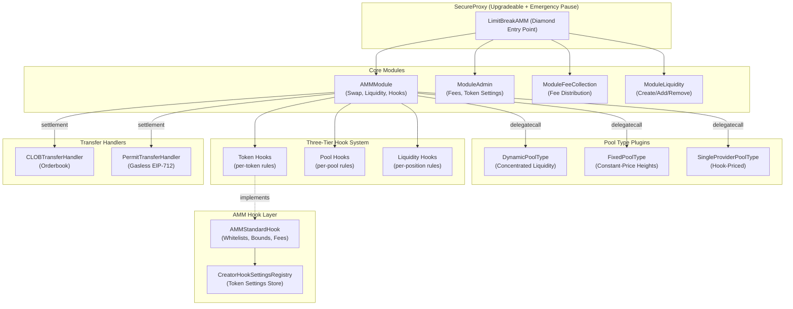
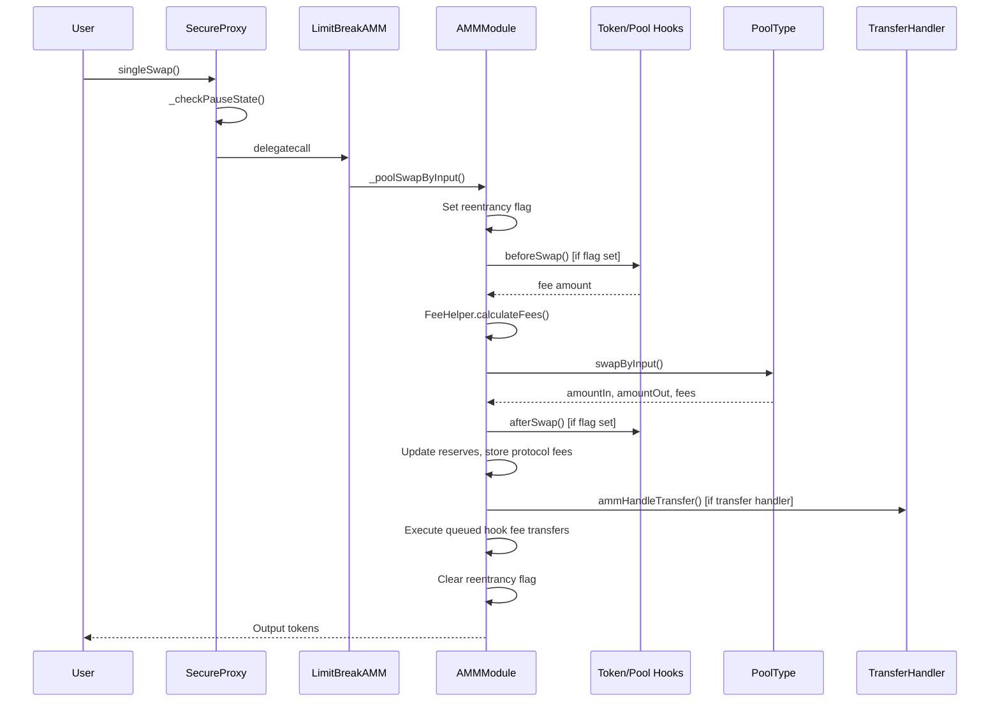
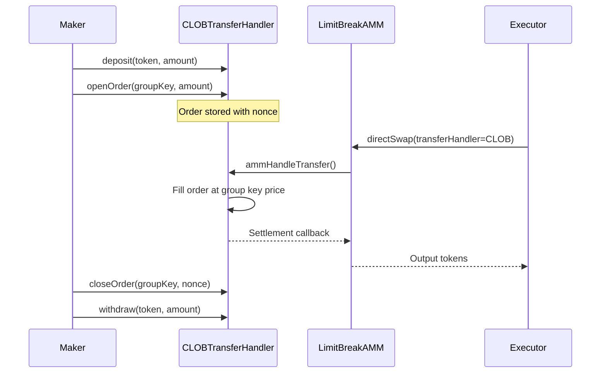
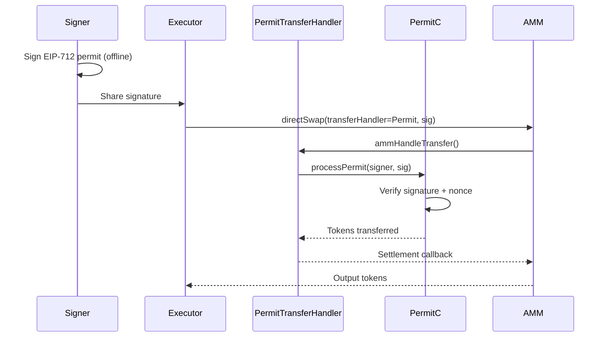

# Codebase Map

> Auto-generated by Cartographer. Last mapped: 2026-03-09

## System Overview

The Limit Break AMM is a modular, hook-extensible automated market maker protocol. It uses a diamond proxy pattern with pluggable pool types, a three-tier hook system, and custom transfer handlers for flexible settlement.



## Directory Structure

```
limit-break-amm/
├── lbamm-core/                    # Core AMM protocol (diamond proxy + modules)
│   ├── src/
│   │   ├── LimitBreakAMM.sol      # Entry point (composes all modules)
│   │   ├── modules/
│   │   │   ├── AMMModule.sol       # Core swap/liquidity/hook logic (34K tokens)
│   │   │   ├── ModuleAdmin.sol     # Fee & token settings management
│   │   │   ├── ModuleFeeCollection.sol  # Fee collection & distribution
│   │   │   └── ModuleLiquidity.sol # Liquidity operations wrapper
│   │   ├── libraries/
│   │   │   ├── FeeHelper.sol       # Fee calculation (input/output swaps)
│   │   │   ├── LBAMMStorage.sol    # Diamond storage layout
│   │   │   └── PoolDecoder.sol     # Pool ID bit extraction
│   │   ├── interfaces/             # Hook, pool type, handler interfaces
│   │   ├── Constants.sol           # Reentrancy flags, fee constants
│   │   ├── DataTypes.sol           # PoolState, TokenSettings, etc.
│   │   └── Errors.sol
│   └── test/
│
├── amm-pool-type-dynamic/         # Concentrated liquidity (Uniswap v3-style)
│   ├── src/
│   │   ├── DynamicPoolType.sol     # Pool lifecycle + swap entry points
│   │   ├── libraries/
│   │   │   ├── DynamicHelper.sol   # Position/tick management + swap loop
│   │   │   ├── SqrtPriceMath.sol   # Q64.96 price arithmetic
│   │   │   ├── SwapMath.sol        # Single-step swap calculations
│   │   │   ├── TickMath.sol        # Tick <-> sqrt price conversion
│   │   │   ├── BitMath.sol         # MSB/LSB bit operations
│   │   │   ├── LiquidityMath.sol   # Safe signed liquidity math
│   │   │   └── DynamicPoolDecoder.sol  # Pool ID extraction
│   │   ├── Constants.sol           # Tick bounds, Q-format constants
│   │   ├── DataTypes.sol           # DynamicPoolState, TickInfo, etc.
│   │   └── Errors.sol
│   └── test/
│
├── lbamm-pool-type-fixed/         # Constant-price with height-based liquidity
│   ├── src/
│   │   ├── FixedPoolType.sol       # Pool lifecycle + swap entry points
│   │   ├── FixedPoolQuoter.sol     # Static delegatecall view functions
│   │   ├── libraries/
│   │   │   ├── FixedHelper.sol     # Height system + swap logic (19K tokens)
│   │   │   └── FixedPoolDecoder.sol
│   │   ├── Constants.sol
│   │   ├── DataTypes.sol           # FixedPoolState, HeightState, etc.
│   │   └── Errors.sol
│   └── test/
│
├── lbamm-pool-type-single-provider/  # Single-LP with hook-based pricing
│   ├── src/
│   │   ├── SingleProviderPoolType.sol  # Pool lifecycle
│   │   ├── libraries/SingleProviderHelper.sol  # Swap math
│   │   ├── interfaces/ISingleProviderPoolHook.sol  # Price hook interface
│   │   ├── Constants.sol
│   │   ├── DataTypes.sol
│   │   └── Errors.sol
│   └── test/
│
├── lbamm-hooks-and-handlers/      # Hook layer + transfer handlers (audit target)
│   ├── src/
│   │   ├── hooks/
│   │   │   ├── AMMStandardHook.sol          # Token hook: whitelists, bounds, fees
│   │   │   ├── CreatorHookSettingsRegistry.sol  # Settings storage + sync
│   │   │   ├── interfaces/                   # IAMMStandardHook, ICreatorHookSettingsRegistry
│   │   │   ├── libraries/SqrtPriceCalculator.sol
│   │   │   ├── DataTypes.sol
│   │   │   └── Errors.sol
│   │   └── handlers/
│   │       ├── clob/
│   │       │   ├── CLOBTransferHandler.sol   # On-chain orderbook handler
│   │       │   ├── CLOBQuotor.sol            # Read-only order quoting
│   │       │   ├── libraries/CLOBHelper.sol  # Order math + fill logic
│   │       │   ├── interfaces/ICLOBHook.sol  # CLOB validation hook
│   │       │   ├── Constants.sol
│   │       │   ├── DataTypes.sol
│   │       │   └── Errors.sol
│   │       ├── permit/
│   │       │   ├── PermitTransferHandler.sol  # EIP-712 gasless transfers
│   │       │   ├── Constants.sol              # SWAP_TYPEHASH, permit types
│   │       │   ├── DataTypes.sol
│   │       │   └── Errors.sol
│   │       └── interfaces/ITransferHandlerExecutorValidation.sol
│   └── test/                      # Unit, fuzz, PoC, economic analysis
│
├── secure-proxy/                  # Upgradeable proxy + emergency pause
│   ├── src/
│   │   ├── SecureProxy.sol        # EIP-1967 proxy with tiered pause codes
│   │   ├── Constants.sol          # Tier durations, roles, storage slots
│   │   ├── DataTypes.sol          # SecurityStorage, CodeStorage
│   │   └── Errors.sol
│   └── test/
│
└── docs/
    └── CODEBASE_MAP.md            # This file
```

## Module Guide

### lbamm-core (Core AMM Protocol)

**Purpose**: Diamond-proxy AMM with modular architecture, three-tier hook system, and pluggable pool types.

**Entry point**: `src/LimitBreakAMM.sol`

| File | Purpose | Tokens |
|------|---------|--------|
| LimitBreakAMM.sol | Diamond entry point composing all modules | 9,435 |
| modules/AMMModule.sol | Core swap, liquidity, hook orchestration | 34,327 |
| modules/ModuleAdmin.sol | Fee/token settings management (RBAC) | 3,443 |
| modules/ModuleFeeCollection.sol | Fee collection + deferred transfers | 2,179 |
| modules/ModuleLiquidity.sol | Liquidity operations thin wrapper | 3,129 |
| libraries/FeeHelper.sol | Input/output fee calculations | 2,637 |
| libraries/LBAMMStorage.sol | Diamond storage at slot 0x9A1D | 311 |
| libraries/PoolDecoder.sol | Pool ID bit extraction (assembly) | 500 |

**Key abstractions**:
- `ILimitBreakAMMPoolType` - Pool types implement swap/liquidity invariants
- `ILimitBreakAMMTransferHandler` - Custom settlement (CLOB, permits, etc.)
- `ILimitBreakAMMTokenHook` / `PoolHook` / `LiquidityHook` - Three-tier validation

**Access control**: Role-based via `RoleSetClient` (FEE_MANAGER, FEE_RECEIVER, TOKEN_SETTING_MANAGER)

**Storage**: Diamond pattern at slot `0x9A1D`. Transient storage for reentrancy flags and queued fee transfers.

---

### amm-pool-type-dynamic (Concentrated Liquidity)

**Purpose**: Uniswap v3-style concentrated liquidity with tick-based positions, bitmap navigation, and Q128.128 fee growth tracking.

**Entry point**: `src/DynamicPoolType.sol`

| File | Purpose | Tokens |
|------|---------|--------|
| DynamicPoolType.sol | Pool lifecycle, swap entry points | 6,508 |
| libraries/DynamicHelper.sol | Position/tick management, swap loop | 8,770 |
| libraries/SqrtPriceMath.sol | Q64.96 price arithmetic | 5,179 |
| libraries/SwapMath.sol | Single-step swap calculations | 1,767 |
| libraries/TickMath.sol | Tick <-> sqrt price conversion | 3,490 |
| libraries/BitMath.sol | MSB/LSB bit operations | 884 |

**Key mechanics**:
- Positions defined by `[tickLower, tickUpper]` ranges
- Bitmap-driven tick traversal (256 ticks per storage word)
- Fee growth: Q128.128 per-unit accumulators with intentional overflow wrapping
- Rounding: add liquidity rounds UP (LP pays more), remove rounds DOWN

**Known findings**:
- M-01: Gas griefing via zero-liquidity tick traversal (tickSpacing=1)
- L-01: Malformed swapExtraData silently uses defaults (must be 32 bytes)
- L-04: 100% fee asymmetry (input allows, output rejects - intentional)

---

### lbamm-pool-type-fixed (Constant-Price Heights)

**Purpose**: Fixed-price AMM where price is set at creation. Liquidity tracked via a 1D "height" system with doubly-linked lists.

**Entry point**: `src/FixedPoolType.sol`

| File | Purpose | Tokens |
|------|---------|--------|
| FixedPoolType.sol | Pool lifecycle, swap entry points | 5,259 |
| FixedPoolQuoter.sol | View functions via static delegatecall | 2,902 |
| libraries/FixedHelper.sol | Height system, swap logic, fee tracking | 19,448 |
| libraries/FixedPoolDecoder.sol | Pool ID bit extraction | 546 |

**Key mechanics**:
- Price fixed at pool creation, never changes
- Each token side has independent height tracking (1D cumulative consumption metric)
- Positions span `[startHeight, endHeight]` ranges on each side
- Doubly-linked list of active heights for traversal
- Dust accumulation from rounding, swept on withdrawal

---

### lbamm-pool-type-single-provider (Hook-Priced Pools)

**Purpose**: Single-LP pools where pricing is fully delegated to a hook contract. Simplest pool type.

**Entry point**: `src/SingleProviderPoolType.sol`

| File | Purpose | Tokens |
|------|---------|--------|
| SingleProviderPoolType.sol | Pool lifecycle | 4,479 |
| libraries/SingleProviderHelper.sol | Swap math (fixed-point price application) | 1,862 |
| interfaces/ISingleProviderPoolHook.sol | Hook interface for dynamic pricing | 450 |

**Key mechanics**:
- Hook provides price per swap via `getPoolPriceForSwap()`
- Only designated LP (from hook) can add/remove liquidity
- `lastSqrtPriceX96` is cache only; hook controls actual pricing
- Useful for oracle-priced pools, custom fee models, whitelisted swappers

---

### lbamm-hooks-and-handlers (Audit Target)

**Purpose**: Token hook implementation (AMMStandardHook + registry) and two transfer handlers (CLOB orderbook + EIP-712 permits). This is the Guardian Defender audit contest target (Feb-Apr 2026).

**Entry points**: `src/hooks/AMMStandardHook.sol`, `src/handlers/clob/CLOBTransferHandler.sol`, `src/handlers/permit/PermitTransferHandler.sol`

| File | Purpose | Tokens |
|------|---------|--------|
| hooks/AMMStandardHook.sol | Token hook: whitelists, pricing bounds, fees | 9,946 |
| hooks/CreatorHookSettingsRegistry.sol | Settings storage, whitelist management, sync | 11,775 |
| hooks/libraries/SqrtPriceCalculator.sol | Price ratio computation | 1,601 |
| handlers/clob/CLOBTransferHandler.sol | On-chain CLOB orderbook | 6,899 |
| handlers/clob/CLOBQuotor.sol | Read-only order quoting | 1,080 |
| handlers/clob/libraries/CLOBHelper.sol | Order math, fixed-input calculations | 3,138 |
| handlers/permit/PermitTransferHandler.sol | EIP-712 gasless permit transfers | 4,965 |

**AMMStandardHook**: Implements `ILimitBreakAMMTokenHook`. Enforces per-token rules:
- Pair token whitelists (which tokens can pair)
- LP address whitelists (who can provide liquidity)
- Pool type whitelists (which pool types allowed)
- Pricing bounds (min/max sqrt price enforcement)
- Buy/sell fees (BPS-based)
- Trading pause (disable pools)
- Block direct swaps flag

**CreatorHookSettingsRegistry**: Stores per-token settings. Token creators manage their whitelists and hook configuration. Syncs settings to one or more AMMStandardHook instances.

**CLOBTransferHandler**: On-chain central limit order book. Makers deposit tokens, open orders at specific prices (sqrt price encoded in group keys). Orders filled when AMM swaps route through the handler. Supports deposit/withdraw, open/close orders, nonce-based tracking.

**PermitTransferHandler**: EIP-712 signed gasless transfers via PermitC. Supports fill-or-kill and partial-fill permits. Cosigner support for MEV protection. Handles wrapped native tokens.

**Known findings from audit PoCs**:
| Finding | Severity | Description |
|---------|----------|-------------|
| Direct swap pricing bounds bypass | Low | beforeSwap alone provides no bounds check for direct swaps |
| feeOnTop not signed | Low | feeOnTop recipient/amount not in SWAP_TYPEHASH |
| permitProcessor not signed | Low | PermitC address not in typehash (domain separator provides implicit binding) |
| validateHandlerOrder overflow | Low | computeRatioX96 returns 0 on overflow, bypasses max bound |
| Stale transient storage (HOOK-001) | Low | Direct swap input slot never cleared between multi-swap TXs |
| Settings sync initialized flag | Low | setTokenSettings syncs unmodified settings |

---

### secure-proxy (Emergency Pause Proxy)

**Purpose**: EIP-1967 upgradeable proxy with tiered escalating pause codes for rapid cross-chain emergency response.

**Entry point**: `src/SecureProxy.sol`

| File | Purpose | Tokens |
|------|---------|--------|
| SecureProxy.sol | Proxy + 4-tier pause escalation | 4,495 |
| Constants.sol | Tier durations, roles, storage slots | 521 |
| DataTypes.sol | SecurityStorage, CodeStorage | 233 |

**Pause tiers**: Tier 1 (30 min) -> Tier 2 (6 hr) -> Tier 3 (7 days) -> Tier 4 (admin, indefinite). Sequential escalation only. Codes are pre-committed hashes revealed at pause time. Admin can bypass to Tier 4 or clear pause. Upgrades require Tier 4.

---

## Data Flow

### Swap Flow



### CLOB Order Fill Flow



### Permit Transfer Flow



## Conventions

- **Solidity 0.8.24** with Cancun EVM (transient storage)
- **Foundry** for build, test, fuzz
- **Q-format fixed-point**: Q64.96 for prices, Q128.128 for fee growth
- **Token ordering**: token0 < token1 (address comparison)
- **Rounding**: Favors protocol/pool (add liquidity rounds up, remove rounds down)
- **BPS**: 10,000 = 100%. Fee max = 10,000 BPS (input) or 9,999 BPS (output)
- **Pool ID encoding**: 32 bytes bit-packed with pool type address, fee, type-specific data, creation hash
- **Pool type address constraint**: Must have 6 leading zero bytes
- **Diamond storage**: Shared state at slot `0x9A1D`
- **Role-based access**: Via `RoleSetClient` from `tm-core-lib`
- **Error pattern**: Custom errors (gas-efficient reverts)
- **Failed transfers**: Stored as `tokensOwed` rather than reverting (prevents DOS)

## Gotchas

1. **Pool type addresses must have 6 leading zero bytes** - Enforced on pool creation for poolId encoding
2. **Fee growth overflow is intentional** - Q128.128 accumulators wrap by design (matches Uniswap v3)
3. **100% fee asymmetry** - Input swaps allow 100% fee, output swaps reject it (avoids division by zero)
4. **Transient storage not cleared** - Direct swap input amount slot is never cleared between swaps in same TX (HOOK-001)
5. **feeOnTop is not signed** - Executor can set arbitrary feeOnTop without invalidating permit signature
6. **swapExtraData must be exactly 32 bytes** - Non-standard lengths silently use default price limits
7. **Dynamic pool fee sentinel** - `poolFeeBPS = 55555` means hook must calculate fee dynamically
8. **Hook flag validation** - Token hook declares required/supported flags; mismatched settings revert
9. **Zero liquidity operations collect fees** - Calling addLiquidity with 0 change acts as fee collection
10. **SecureProxy pause auto-clears** - Expired pauses cleared silently on next stateful call

## Navigation Guide

**To add a new pool type**: Implement `ILimitBreakAMMPoolType` in a new repo. Deploy with 6 leading zero bytes address. Core AMM delegates swap/liquidity calls to it.

**To add a new transfer handler**: Implement `ILimitBreakAMMTransferHandler`. Register as transfer handler via direct swap. Settlement occurs via `ammHandleTransfer()` callback.

**To add a new token hook**: Implement `ILimitBreakAMMTokenHook`. Set via `ModuleAdmin.setTokenSettings()`. Declare required/supported flags.

**To modify fee calculations**: `lbamm-core/src/libraries/FeeHelper.sol` for protocol-level fees. Pool-type-specific fees in each pool type's swap functions.

**To modify hook enforcement**: `lbamm-hooks-and-handlers/src/hooks/AMMStandardHook.sol` for standard hook logic. `CreatorHookSettingsRegistry.sol` for settings storage.

**To modify CLOB logic**: `lbamm-hooks-and-handlers/src/handlers/clob/CLOBTransferHandler.sol` for order management. `CLOBHelper.sol` for math.

**To modify permit logic**: `lbamm-hooks-and-handlers/src/handlers/permit/PermitTransferHandler.sol`. Constants.sol for typehashes.

**To modify pause/upgrade mechanism**: `secure-proxy/src/SecureProxy.sol` for pause tiers and proxy logic.

**To run tests**: `cd <repo> && forge test` (each repo is independent with its own foundry.toml)

**To run fuzz tests**: `cd lbamm-hooks-and-handlers && forge test --match-path test/audit/fuzz/`

**To run audit PoCs**: `cd lbamm-hooks-and-handlers && forge test --match-path test/audit/poc/`
