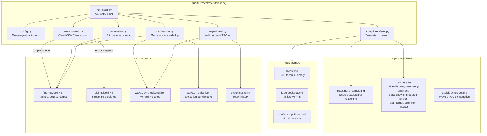
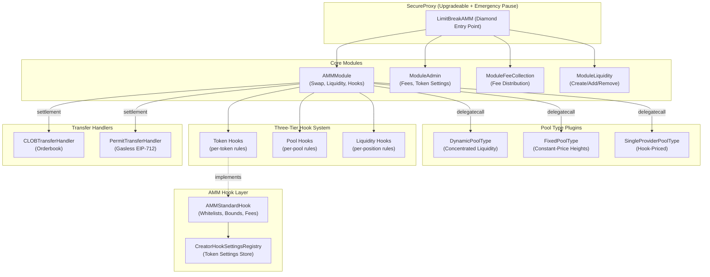
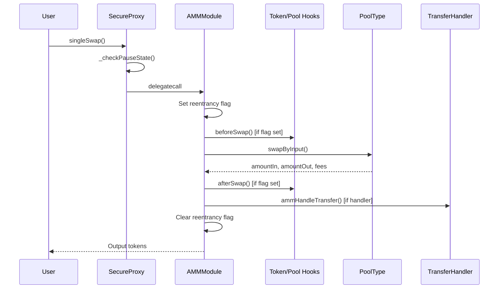

# Codebase Map

> Auto-generated by Cartographer. Last mapped: 2026-03-14

## System Overview

This repo is the **orchestration framework** for a security audit of the Limit Break AMM protocol. The target Solidity code lives in 6 sibling repos (not tracked here). This repo contains the agent pipeline, templates, scoring, and artifacts.



### Target Protocol Architecture

The Limit Break AMM is a modular, hook-extensible AMM using a diamond proxy pattern with pluggable pool types, a three-tier hook system, and custom transfer handlers.



## Directory Structure

```
limit-break-amm/                          # THIS REPO — orchestration framework
├── CLAUDE.md                              # Project instructions
├── .claude/settings.local.json            # Tool permissions for spawned agents
├── docs/
│   ├── CODEBASE_MAP.md                    # This file
│   ├── orchestrator/                      # Python pipeline
│   │   ├── run_audit.py                   # CLI: --wave, --fresh, --experiment
│   │   ├── config.py                      # Wave/agent/repo definitions
│   │   ├── wave_runner.py                 # ClaudeSDKClient agent spawning
│   │   ├── synthesizer.py                 # Sidecar merge, scoring, dedup (largest file)
│   │   ├── experiment.py                  # audit_score computation + TSV log
│   │   ├── regression.py                  # Known-bug regression checker (fuzzy text match)
│   │   ├── schema.py                      # findings.json schema + validation
│   │   ├── safety.py                      # FP pre-filter
│   │   ├── model_profiles.py              # Opus/Sonnet/Haiku capability profiles
│   │   ├── prompt_renderer.py             # Template rendering + memory injection
│   │   ├── run_manager.py                 # Run lifecycle, archival, manifest
│   │   ├── memory_lifecycle.py            # Post-run memory updates
│   │   ├── artifact_generator.py          # Phase 0: build-info fix + Slither/Aderyn
│   │   ├── phase0_runner.py               # Older Phase 0 runner (partially superseded)
│   │   ├── run_postprocess.py             # Manual post-processing after crashed runs
│   │   ├── regression_cases.json          # 4 ground-truth regression bugs
│   │   ├── custom_detectors/              # 4 custom Slither detectors
│   │   ├── harnesses/                     # 4 Solidity exploit test harnesses
│   │   ├── templates/                     # Active agent prompt templates
│   │   │   ├── black-hat-preamble.md      # Shared exploit-first reasoning ({{PREAMBLE}})
│   │   │   ├── price-distorter.md         # Cross-venue price manipulation
│   │   │   ├── insolvency-engineer.md     # Bad debt / reserve drain
│   │   │   ├── state-desync.md            # Cross-module state divergence
│   │   │   ├── precision-sniper.md        # Math boundary / rounding
│   │   │   ├── auth-forger.md             # Permit / signature forging
│   │   │   ├── extension-hijacker.md      # Hook / handler abuse
│   │   │   ├── exploit-developer.md       # Wave 2 PoC construction
│   │   │   └── archive/                   # Old defensive templates
│   │   └── archive/                       # Old defensive config
│   ├── framework/                         # Shared reference docs (read by agents)
│   │   ├── agent-boilerplate.md           # Universal agent reference (tools, checkpoints, FP gate)
│   │   ├── tool-guide.md                  # Per-tool flags, gotchas, templates
│   │   ├── amm-invariant-catalog.md       # 20 invariants, 6 categories
│   │   └── value-lifecycle-lenses.md      # 3 cross-boundary analysis lenses
│   ├── audit_memory/                      # Injected into agent prompts
│   │   ├── digest.md                      # ~200 token summary (always injected)
│   │   ├── false-positives.md             # 55 known FPs (grepped on demand)
│   │   ├── confirmed-patterns.md          # 6 real vulnerability patterns
│   │   ├── lessons-learned.md             # 7 reflexion-style lessons
│   │   └── run-episodes/                  # Per-run episode records
│   ├── targets/full-system/               # Active audit target
│   │   ├── artifacts/                     # Wave outputs
│   │   │   ├── wave1-{agent}/findings.json  # Agent sidecars (structured)
│   │   │   ├── wave1-{agent}/claims.jsonl   # Agent claims (streaming)
│   │   │   ├── wave1-synthesis.md/json      # Merged synthesis
│   │   │   ├── phase0/                      # Pre-computed static analysis
│   │   │   └── manifest.json                # Run state tracker
│   │   ├── results/                       # Metrics + safety events
│   │   ├── experiments.tsv                # Score history (untracked)
│   │   └── research-program.md            # Meta-researcher instructions
│   ├── plans/                             # Implementation plans
│   └── references/                        # Research materials

# TARGET REPOS (sibling directories, separate git repos)
lbamm-core/                               # Core AMM: diamond proxy + modules
amm-pool-type-dynamic/                    # Concentrated liquidity (Uniswap v3-style)
lbamm-pool-type-fixed/                    # Constant-price with height-based liquidity
lbamm-pool-type-single-provider/          # Single-LP with hook-based pricing
lbamm-hooks-and-handlers/                 # Hook layer + CLOB + permit handlers
secure-proxy/                             # Upgradeable proxy (read-only dependency)
```

## Orchestrator Pipeline

### Full Run Flow

```
CLI: .venv/bin/python3 -m docs.orchestrator.run_audit --wave 1 --fresh --experiment
  │
  ├─ ensure_run(fresh=True)                     [run_manager.py]
  │    └─ Archive existing artifacts → archive/{run_id}/
  │
  ├─ render_wave_prompts(wave)                   [prompt_renderer.py]
  │    ├─ Load archetype template (e.g. price-distorter.md)
  │    ├─ Inject {{PREAMBLE}} from black-hat-preamble.md
  │    ├─ Inject {{PHASE0_ARTIFACTS}} file list
  │    ├─ Append memory block (digest + scoped FPs + patterns + lessons)
  │    └─ Write rendered prompts to wave1-prompts/{name}.md
  │
  ├─ run_wave(wave, prompts)                     [wave_runner.py]
  │    ├─ Build team lead prompt (TeamCreate → N × Agent → TeamDelete)
  │    ├─ Open ClaudeSDKClient(setting_sources=["user","project","local"])
  │    ├─ Team lead spawns 6 agents with run_in_background=True
  │    ├─ Each agent: reads prompt from disk → investigates → writes artifacts
  │    ├─ Monitor for WAVE_COMPLETE marker or 5-min bail-out
  │    └─ _build_results_from_disk() → list[AgentResult]
  │
  ├─ collect_artifacts(wave)                     [wave_runner.py]
  ├─ validate_sidecars(wave)                     [schema.py]
  ├─ run_regression_check(wave)                  [regression.py]
  │    └─ Structured match + fuzzy text fallback against 4 regression cases
  │
  ├─ prefilter_findings(findings)                [safety.py]
  │    └─ Match against false-positives.md (confidence ≥ 80 → NOOP)
  │
  ├─ generate_synthesis(wave)                    [synthesizer.py]
  │    ├─ Read all findings.json + claims.jsonl
  │    ├─ Deterministic hotspot scoring (no LLM)
  │    ├─ Dedup findings (transitive contract+function overlap)
  │    ├─ Detect contradictions (finding vs ruled-out with shared keywords)
  │    ├─ Check tool coverage (mandatory: slither, aderyn, audit_context_building, entry_point_analyzer)
  │    └─ Write wave1-synthesis.md, wave1-synthesis.json, wave1-metrics.json
  │
  ├─ update_memory_from_results()                [memory_lifecycle.py]
  │
  └─ compute_audit_score() + log_experiment()    [experiment.py]
       audit_score = 25×regression + 40×findings(cap 200) + 0.15×tool_pct + 0.10×vectors(cap 10) + 0.10×forge(cap 10)
```

### Agent Artifact Contract

Each agent writes to `docs/targets/full-system/artifacts/wave{N}-{name}/`:

| File | Required | Consumer |
|------|----------|----------|
| `findings.json` | Yes | synthesizer, regression, experiment |
| `claims.jsonl` | No | synthesizer (supplementary) |
| `report.md` | Yes | Human review, memory_lifecycle |

**Schema tolerances**: `"agent"` accepted for `"agent_name"`, bare JSON arrays normalized to dict wrapper, `"ruled_out"` accepted for `"ruled_out_vectors"`, fuzzy tool key matching (`slither_mcp_run_detectors` → `slither`).

### Template Composition

```
archetype template (e.g. price-distorter.md)
  ├─ First Action: read agent-boilerplate.md + CODEBASE_MAP.md
  ├─ Profit Question + Attack Playbook + Target Map + 8-11 Hypotheses
  ├─ {{PREAMBLE}} ← black-hat-preamble.md (inline, reliably followed)
  │    ├─ 7-step attacker reasoning loop
  │    ├─ 4 known vulnerability patterns (regression seeds)
  │    ├─ 5 mandatory attack probes
  │    ├─ Sidecar JSON schema (full spec)
  │    ├─ 3 mandatory tool checkpoints (inline CLI commands)
  │    └─ Pre-completion gate (6-item checklist)
  ├─ {{PHASE0_ARTIFACTS}} ← static analysis file paths
  └─ Memory block (digest + scoped FPs + patterns + lessons)
```

**Critical lesson**: Inline instructions → followed. File references ("Read X.md") → skipped. Tool checkpoints must be in the preamble, not just in boilerplate.

## Target Solidity Repos

### lbamm-core (Core AMM Protocol)

**Purpose**: Diamond-proxy AMM with modular architecture, three-tier hook system, and pluggable pool types.

**Entry point**: `src/LimitBreakAMM.sol`

| File | Purpose | Tokens |
|------|---------|--------|
| LimitBreakAMM.sol | Diamond entry point composing all modules | 9,435 |
| modules/AMMModule.sol | Core swap, liquidity, hook orchestration | 34,327 |
| modules/ModuleAdmin.sol | Fee/token settings management (RBAC) | 3,443 |
| modules/ModuleFeeCollection.sol | Fee collection + deferred transfers | 2,179 |
| modules/ModuleLiquidity.sol | Liquidity operations thin wrapper | 3,129 |
| libraries/FeeHelper.sol | Input/output fee calculations | 2,637 |
| libraries/LBAMMStorage.sol | Diamond storage at slot 0x9A1D | 311 |
| libraries/PoolDecoder.sol | Pool ID bit extraction (assembly) | 500 |

**Key abstractions**:
- `ILimitBreakAMMPoolType` - Pool types implement swap/liquidity invariants
- `ILimitBreakAMMTransferHandler` - Custom settlement (CLOB, permits, etc.)
- `ILimitBreakAMMTokenHook` / `PoolHook` / `LiquidityHook` - Three-tier validation

**Storage**: Diamond pattern at slot `0x9A1D`. Transient storage for reentrancy flags and queued fee transfers.

---

### amm-pool-type-dynamic (Concentrated Liquidity)

**Purpose**: Uniswap v3-style concentrated liquidity with tick-based positions, bitmap navigation, and Q128.128 fee growth tracking.

**Entry point**: `src/DynamicPoolType.sol`

| File | Purpose | Tokens |
|------|---------|--------|
| DynamicPoolType.sol | Pool lifecycle, swap entry points | 6,508 |
| libraries/DynamicHelper.sol | Position/tick management, swap loop | 8,770 |
| libraries/SqrtPriceMath.sol | Q64.96 price arithmetic | 5,179 |
| libraries/SwapMath.sol | Single-step swap calculations | 1,767 |
| libraries/TickMath.sol | Tick <-> sqrt price conversion | 3,490 |

**Key mechanics**: Positions by `[tickLower, tickUpper]` ranges. Bitmap-driven tick traversal. Fee growth Q128.128 with intentional overflow wrapping. Rounding favors protocol.

---

### lbamm-pool-type-fixed (Constant-Price Heights)

**Purpose**: Fixed-price AMM with 1D "height" system and doubly-linked lists for liquidity tracking.

**Entry point**: `src/FixedPoolType.sol`

| File | Purpose | Tokens |
|------|---------|--------|
| FixedPoolType.sol | Pool lifecycle, swap entry points | 5,259 |
| libraries/FixedHelper.sol | Height system, swap logic, fee tracking | 19,448 |

---

### lbamm-pool-type-single-provider (Hook-Priced Pools)

**Purpose**: Single-LP pools where pricing is fully delegated to a hook contract.

**Entry point**: `src/SingleProviderPoolType.sol`

---

### lbamm-hooks-and-handlers (Hooks + Transfer Handlers)

**Purpose**: Token hook implementation (AMMStandardHook + registry) and two transfer handlers (CLOB + permits).

| File | Purpose | Tokens |
|------|---------|--------|
| hooks/AMMStandardHook.sol | Token hook: whitelists, pricing bounds, fees | 9,946 |
| hooks/CreatorHookSettingsRegistry.sol | Settings storage, whitelist management, sync | 11,775 |
| hooks/libraries/SqrtPriceCalculator.sol | Price ratio computation | 1,601 |
| handlers/clob/CLOBTransferHandler.sol | On-chain CLOB orderbook | 6,899 |
| handlers/clob/libraries/CLOBHelper.sol | Order math, fixed-input calculations | 3,138 |
| handlers/permit/PermitTransferHandler.sol | EIP-712 gasless permit transfers | 4,965 |

---

### secure-proxy (Emergency Pause Proxy)

**Purpose**: EIP-1967 upgradeable proxy with 4-tier escalating pause codes.

---

## Data Flow

### Swap Flow



## Conventions

- **Solidity 0.8.24** with Cancun EVM (transient storage)
- **Foundry** for build, test, fuzz
- **Q-format fixed-point**: Q64.96 for prices, Q128.128 for fee growth
- **Rounding**: Favors protocol/pool (add rounds up, remove rounds down)
- **BPS**: 10,000 = 100%. Fee max = 10,000 BPS (input) or 9,999 BPS (output)
- **Pool type address constraint**: Must have 6 leading zero bytes
- **Diamond storage**: Shared state at slot `0x9A1D`
- **Build tools**: Run inside target repos (`cd <repo> && forge build`)

## Gotchas

1. **Pool type addresses must have 6 leading zero bytes** — enforced on pool creation for poolId encoding
2. **Fee growth overflow is intentional** — Q128.128 wraps by design (Uniswap v3 pattern)
3. **100% fee asymmetry** — input allows, output rejects (avoids division by zero)
4. **Transient storage not cleared (HOOK-001)** — direct swap input slot not cleared between same-TX swaps
5. **feeOnTop is not signed** — executor can set arbitrary feeOnTop without invalidating permit (intentional — `limitAmount` cap protects signer)
6. **swapExtraData must be exactly 32 bytes** — non-standard lengths silently use default price limits
7. **All prior submissions rejected (0/8)** — only submit Medium+ with demonstrable economic impact

## Navigation Guide

**To run an experiment**: `.venv/bin/python3 -m docs.orchestrator.run_audit --wave 1 --fresh --experiment --description "what changed"`

**To modify agent behavior**: Edit templates in `docs/orchestrator/templates/` (preamble for all agents, archetype for specific ones)

**To modify scoring**: Read-only — `experiment.py` and `regression_cases.json` are immutable per research-program.md

**To add a new archetype**: Add template to `templates/`, add `AgentConfig` to `WAVE_BH1` in `config.py`

**To debug a failed run**: Check `results/wave1-safety.jsonl` for events, `experiments.tsv` for scores, run `run_postprocess.py` to re-synthesize from existing artifacts

**To run Forge tests in target repos**: `cd <repo> && forge test`
