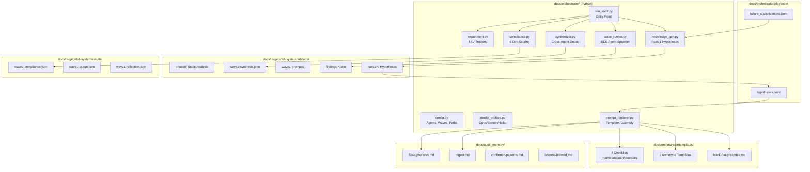

# Codebase Map

> Auto-generated by Cartographer. Last mapped: 2026-03-28

## System Overview

This is the **orchestration framework** for the Limit Break AMM security audit. It does not contain Solidity source code — that lives in 6 sibling repos. This repo contains the Python pipeline that spawns AI agents, scores their output, and tracks findings across runs.



## Directory Structure

```
limit-break-amm/                      # This repo (framework only)
├── CLAUDE.md                          # Session bootstrap instructions
├── .claude/skills/context-sync/       # Context staleness detection skill
├── .mcp.json                          # MCP server config (empty — user-level)
├── .gitignore                         # Excludes target repos, .venv, archives
│
├── docs/
│   ├── SYSTEM_GUIDE.md                # Canonical human-readable pipeline spec (640 lines)
│   ├── CODEBASE_MAP.md                # This file
│   │
│   ├── orchestrator/                  # Python pipeline (27 modules)
│   │   ├── config.py                  # Paths, agents, waves, boundaries
│   │   ├── model_profiles.py          # 6 model profiles (Opus/Sonnet/Haiku)
│   │   ├── run_audit.py               # Entry point — full pipeline orchestration
│   │   ├── wave_runner.py             # SDK agent spawner (asyncio, retry, circuit breaker)
│   │   ├── prompt_renderer.py         # Template + memory assembly
│   │   ├── knowledge_gen.py           # Pass 1 boundary agents → hypotheses
│   │   ├── knowledge_compliance.py    # Pass 1 hypothesis quality scoring
│   │   ├── playbook.py                # Cross-run hypothesis persistence (JSONL)
│   │   ├── synthesizer.py             # Cross-agent dedup, hotspot scoring
│   │   ├── compliance.py              # 6-dimension agent scoring (0-120)
│   │   ├── compliance_continuation.py # Repair agents for low-scoring agents
│   │   ├── schema.py                  # Sidecar JSON schema + coercion
│   │   ├── sidecar_gate.py            # Draft → final sidecar promotion gate
│   │   ├── kill_gate.py               # 7-gate finding pre-filter
│   │   ├── safety.py                  # FP matching pre-filter
│   │   ├── reflection.py              # Post-wave analysis + memory updates
│   │   ├── experiment.py              # TSV experiment tracking
│   │   ├── regression.py              # Known-finding regression checks
│   │   ├── run_manager.py             # Run lifecycle, archival, pruning
│   │   ├── memory_lifecycle.py        # FP staging, episode writing
│   │   ├── phase0_runner.py           # Scripted Slither/Aderyn pre-pass
│   │   ├── artifact_generator.py      # Build-info patching for cross-repo
│   │   ├── test_verifier.py           # Independent Forge test verification
│   │   ├── generate_gotchas.py        # Per-archetype compliance feedback
│   │   ├── critic.py                  # Hypothesis failure classification
│   │   ├── blind_spot_scanner.py      # Exploit pattern coverage checker
│   │   ├── run_postprocess.py         # Standalone re-synthesis
│   │   │
│   │   ├── templates/                 # Agent prompt templates
│   │   │   ├── black-hat-preamble.md  # Shared methodology (all agents)
│   │   │   ├── {archetype}/prompt.md  # 9 archetype prompts
│   │   │   ├── {archetype}/gotchas.md # Auto-generated compliance feedback
│   │   │   ├── checklist-{group}.md   # 4 phase C checklists
│   │   │   ├── continuation-prompt.md # Repair agent template
│   │   │   ├── knowledge-gen-prompt/  # Pass 1 boundary agent template
│   │   │   ├── exploit-developer.md   # Wave 2 PoC agent
│   │   │   └── reflection-agent-prompt.md
│   │   │
│   │   ├── playbook/                  # Cross-run knowledge persistence
│   │   │   ├── hypotheses.jsonl       # All generated hypotheses
│   │   │   ├── failure_classifications.jsonl
│   │   │   └── metadata.json          # Run counter
│   │   │
│   │   └── tests/                     # 218+ pytest tests
│   │
│   ├── audit_memory/                  # Hierarchical audit memory
│   │   ├── digest.md                  # ~200 token summary (injected into all agents)
│   │   ├── false-positives.md         # 55+ known FPs
│   │   ├── confirmed-patterns.md      # 6 confirmed vulnerability patterns
│   │   ├── lessons-learned.md         # 8 procedural lessons
│   │   └── run-episodes/              # Per-run episode records
│   │
│   ├── targets/full-system/           # Active audit target
│   │   ├── artifacts/                 # Agent outputs (sidecars, prompts, logs)
│   │   │   ├── phase0/               # Static analysis baseline
│   │   │   ├── pass1-{boundary}/     # Hypothesis JSONs
│   │   │   ├── wave1-prompts/        # Rendered agent prompts
│   │   │   ├── findings-{agent}.json # Final validated sidecars
│   │   │   ├── wave1-synthesis.*     # Cross-agent synthesis
│   │   │   └── archive/              # Archived runs (gitignored)
│   │   ├── results/                   # Scoring + analysis
│   │   │   ├── wave1-compliance.json
│   │   │   ├── wave1-usage.json
│   │   │   ├── wave1-reflection.json
│   │   │   └── dimension-history.jsonl
│   │   └── experiments.tsv            # Run history (gitignored)
│   │
│   ├── framework/                     # Shared methodology docs
│   │   ├── agent-boilerplate.md       # Universal agent onboarding
│   │   ├── tool-guide.md              # CLI tool usage guide
│   │   ├── amm-invariant-catalog.md   # 18 named invariants
│   │   └── value-lifecycle-lenses.md  # 3-lens cross-boundary methodology
│   │
│   ├── plans/                         # Architecture plans
│   ├── references/                    # Research materials
│   └── superpowers/plans/             # Implementation plans
│
└── [6 sibling repos]                  # Target Solidity code (own git repos)
    ├── lbamm-core/
    ├── amm-pool-type-dynamic/
    ├── lbamm-pool-type-fixed/
    ├── lbamm-pool-type-single-provider/
    ├── lbamm-hooks-and-handlers/
    └── secure-proxy/
```

## Pipeline Execution Flow

```
Phase 0 (once)     artifact_generator → phase0/*.md (Slither + Aderyn per repo)
        │
Pass 1             knowledge_gen → pass1-*/hypotheses-*.json (6 boundary agents, Sonnet)
        │                ↓
        │           playbook.py appends → hypotheses.jsonl
        │                ↓
Wave 1             prompt_renderer assembles templates + memory + hypotheses
        │                ↓
        │           wave_runner spawns 9 agents via SDK query() (parallel, 500 turns max)
        │                ↓
        │           Agents write findings-{name}-draft.json → sidecar_gate promotes to final
        │                ↓
Scoring            compliance.score_wave() → 6 dimensions × 9 agents
        │                ↓
        │           compliance_continuation (agents below 60 get repair pass)
        │                ↓
Gates              kill_gate (7 pre-filters) → safety (FP match) → regression check
        │                ↓
Synthesis          synthesizer.generate_synthesis() → wave1-synthesis.json
        │                ↓
Feedback           reflection → gotchas → experiment.log_experiment() → experiments.tsv
```

## Agent Roster (Wave 1)

| Agent | Profile | Thinking | Scope | Checklist |
|-------|---------|----------|-------|-----------|
| precision-sniper | Opus (max_reasoning) | adaptive | All 6 repos | C-MATH (39 items) |
| state-desync | Opus (max_reasoning) | adaptive | All 6 repos | C-STATE (25 items) |
| auth-forger | Opus (max_reasoning) | adaptive | hooks, core | C-AUTH (22 items) |
| cross-boundary | Opus (max_reasoning) | adaptive | All 6 repos | C-BOUNDARY (22 items) |
| math-deep-diver | Opus (audit_balanced) | adaptive | fixed, dynamic, core, hooks | C-MATH (39 items) |
| insolvency-engineer | Opus (audit_balanced) | adaptive | core, dynamic, fixed, hooks | C-STATE (25 items) |
| extension-hijacker | Opus (audit_balanced) | adaptive | hooks, core | C-BOUNDARY (22 items) |
| composability-exploiter | Sonnet (fast_reasoning) | 32K fixed | All 6 repos | C-STATE (25 items) |
| price-distorter | Sonnet (fast_reasoning) | 32K fixed | All 6 repos | C-MATH (39 items) |

## Compliance Scoring (6 Dimensions, 120 max)

| Dimension | Max | What it measures |
|-----------|-----|-----------------|
| Checklist | 30 | % of Phase C items completed |
| Tool Breadth | 20 | 7 required tools used (Slither, Aderyn, Forge, Halmos, Medusa, audit-context, entry-point) |
| Evidence | 20 | Ruled-out vectors with test evidence |
| Depth | 20 | Turns used + files read + Forge tests written |
| Thesis | 10 | Hypothesis progression (tested → confirmed/ruled_out) |
| Hypothesis | 20 | Injected hypothesis completion rate |

Grades: A (90+), B (80+), C (70+), D (60+), F (<60)

## Memory Hierarchy

```
digest.md (200 tokens, always injected)
├── false-positives.md (55+ FPs, scoped by agent role, confidence >= 80)
├── confirmed-patterns.md (6 real patterns, always injected)
├── lessons-learned.md (8 lessons, filtered by audience)
└── run-episodes/ (per-run records, NOT injected — used for distillation)

playbook/
├── hypotheses.jsonl (Pass 1 → routed to Wave 1 via {{HYPOTHESES}})
├── failure_classifications.jsonl (agent dismissals → Elo downweight)
└── metadata.json (run counter + git commit)
```

## Template Assembly

```
<agent_prompt>
  [archetype header — profit question, target map, hypotheses]
  <preamble>
    <reasoning_loop>     7-step attacker loop
    <finding_definition> what counts as a finding
    <safe_patterns>      skip list (known safe patterns)
    <mandatory_tools>    Phases A-D checklist
      <checklist>        39/25/22/22 items per group
    <output_schema>      sidecar JSON template
  </preamble>
  <injected_memory>
    <digest>             200-token summary
    <false_positives>    role-scoped FPs
    <confirmed_patterns> 6 real patterns
    <lessons>            8 procedural lessons
  </injected_memory>
</agent_prompt>
```

## Navigation Guide

**To run an audit**: `.venv/bin/python3 -m docs.orchestrator.run_audit --wave 1 --fresh --experiment --description "..."`

**To add a new agent**: Add `AgentConfig` to `config.py:WAVE_BH1`, create `templates/{name}/prompt.md`, map to checklist in `prompt_renderer.py:_CHECKLIST_MAP`

**To add a new checklist item**: Edit `templates/checklist-{group}.md`, update count in `preamble.md` and `compliance.py:CHECKLIST_EXPECTED`

**To add a new tool**: Add to `preamble.md` Phase A/B section, add to `compliance.py:REQUIRED_TOOLS` or `BONUS_TOOLS`

**To debug a failed agent**: Check `artifacts/findings-{name}.json` (sidecar), `artifacts/agent-log-{name}.jsonl` (turns), `results/wave1-compliance.json` (scores)

**To check experiment history**: `cat docs/targets/full-system/experiments.tsv | column -t -s$'\t'`

If cartographer helped you, consider starring: https://github.com/kingbootoshi/cartographer - please!
